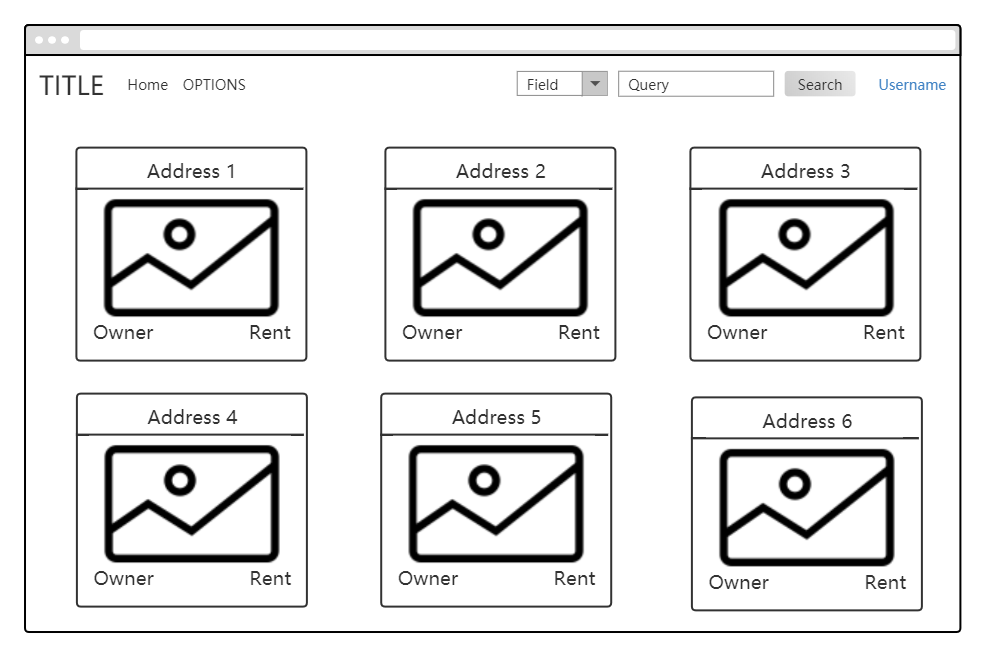
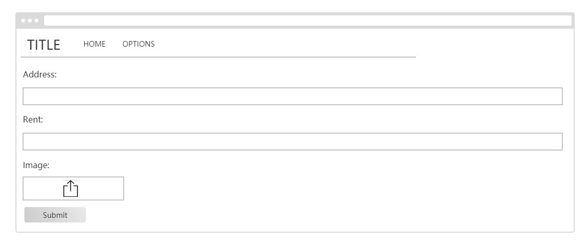

# Document of Housing Profile
- [Introduction](#intro)
- [Requirement](#req)
- [API](#api)
- [UI Design](#ui)


## <a name="intro">Introduction</a>
This is the document of housing profile module. This module
implements displaying, creating, updating housing profiles. Please refer to this as a guideline. 

## <a name="req">Requirement</a>
### Functional Requirement
- All users shall be able to see all the housing profiles, including housing image, location, rents, landlord's name.
- A landlord shall be able to create a new housing.
- A tenant shall be able to send emails to a landlord through clicking on landlord's name.
- Tenants shall not be able to create a new housing.


### Non-functional Requirement
- Housing display should adapt to the screen size of the user
- 6 housings shall be displayed on every single page.


## <a name="api">API</a>
### /api/housings/

#### Request Method
GET

#### Function
List all the housings in the database


#### Parameter
None


#### Response Example
```
{
    'data': {
                {
                    'pk': 1,
                    'owner': {
                        'username': "chenshm",
                        'email': "844650898@qq.com",
                    },
                    'rent': 500,
                    'address': "274 Lester St",
                    'image': "http://localhost:8000/media/housing_images/user_1/274_Lester.jpg",
                },
                {
                    'pk': 2,
                    'owner': {
                        'username': "gurongzhi",
                        'email': "gurongzhi1997@gmail.com",
                    },
                    'rent': 1350,
                    'address': "268 Lester St",
                    'image': "http://localhost:8000/media/housing_images/user_2/268_Lester.jpg",
                },

                ......
    },
    'nextlink': "/api/housings/?page=3",
    'prevlink': "/api/housings/?page=1",
}
```

#### Possible Error State
None

#### Request Method
POST

#### Function
Create a new housing

#### Parameter
| Attribute | Type     | Required | Description|
| ---       |  ------  |--------- |----------- |
| rent |  int  | yes      |Housing rent|
| address |  string  | yes   |Address of the housing provided|
| image |  file  | yes      |A picture of the housing provided|


#### Response Example
- 201 CREATED

#### Possible Error State
- 400 BAD REQUEST

---

### /api/housings/&lt;int:pk&gt;
#### Request Method
GET

#### Function
Retrieve, update or delete a housing by id/pk.

#### Parameter

| Attribute | Type     | Required | Description|
| ---       |  ------  |--------- |----------- |
| pk|  integer/string	  | yes      |Id or primary key of the housing|


#### Response Example
```
{
    'pk': 1,
    'owner': {
                'username': "chenshm",
                'email': "844650898@qq.com",
             },
    'rent': 500,
    'address': "274 Lester St",
    'image': "http://localhost:8000/media/housing_images/user_1/274_Lester.jpg",
}
```
#### Possible Error State
- 404 NOT FOUND

#### Request Method
PUT

#### Function
Update a housing by id/pk.

#### Parameter
| Attribute | Type     | Required | Description|
| ---       |  ------  |--------- |----------- |
| rent |  int  | yes      |Housing rent|
| address |  string  | yes   |Address of the housing provided|
| image |  file  | yes      |A picture of the housing provided|

#### Response Example
```
{
    'pk': 1,
    'owner': {
                'username': "chenshm",
                'email': "844650898@qq.com",
             },
    'rent': 500,
    'address': "274 Lester St",
    'image': "http://localhost:8000/media/housing_images/user_1/274_Lester.jpg",
}
```

#### Possible Error State
- 404 NOT FOUND
- 400 BAD REQUEST

#### Request Method
DELETE

#### Function
Delete a housing by id/pk.

#### Parameter

| Attribute | Type     | Required | Description|
| ---       |  ------  |--------- |----------- |
| pk|  integer/string	  | yes      |Id or primary key of the housing|


#### Response Example
- 204 NO CONTENT

#### Possible Error State
- 404 NOT FOUND

---

### /api/myhousing/
#### Request Method
GET

#### Function
Retrieve all the housings with current user id.

#### Parameter
None

#### Response Example
```
{
    'data': {
                {
                    'pk': 5,
                    'owner': {
                        'username': "chenshm",
                        'email': "844650898@qq.com",
                    },
                    'rent': 500,
                    'address': "274 Lester St",
                    'image': "http://localhost:8000/media/housing_images/user_1/274_Lester.jpg",
                },
                {
                    'pk': 8,
                    'owner': {
                        'username': "chenshm",
                        'email': "844650898@qq.com",
                    },
                    'rent': 1350,
                    'address': "268 Lester St",
                    'image': "http://localhost:8000/media/housing_images/user_2/268_Lester.jpg",
                },

                ......
    },
    'nextlink': "/api/myhousings/?page=3",
    'prevlink': "/api/myhousings/?page=1",
}
```
#### Possible Error State
- 404 NOT FOUND


## <a name="ui">UI Design</a>
### Housing List


### Create Housing

