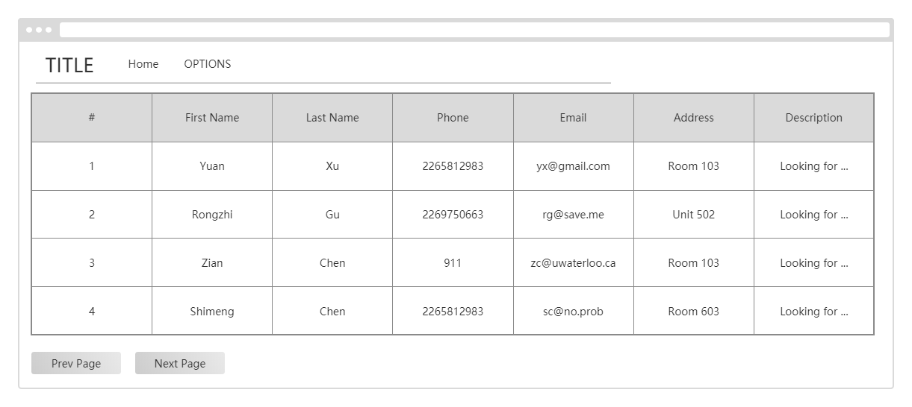
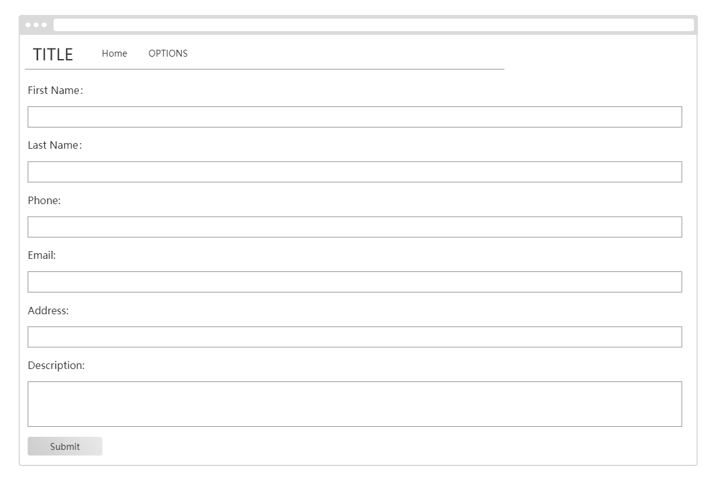

# Document of Request Profile
- [Introduction](#intro)
- [Requirement](#req)
- [API](#api)
- [UI Design](#ui)


## <a name="intro">Introduction</a>
This is the document of request profile module. This module
implements the addition, deletion and modification of the request
profiles. Please refer to this as a guideline. 

## <a name="req">Requirement</a>
### Functional Requirement
- All users shall be able to view the request list
- A tenant shall be able to create a new request including first name, 
last name, phone number, e-mail, address and description of his requirements for the house.
- A tenant can edit (delete or modify) the request posted by him
- A landlard should not be able to create or edit a request

### Non-functional Requirement
- Admin can edit(delete or modify) the request profiles

## <a name="api">API</a>
### /api/customers/

#### Request Method
GET

#### Function
List all the request in the database

#### Parameter
None

#### Response Example
```
{
    'data': {
                {
                    'pk': 1,
                    'first_name': "shimeng",
                    'last_name': "chen",
                    'email': "844650898@qq.com",
                    'phone': "123456789",
                    'address': "white house",
                    'description': "waterloo",
                },
                {
                    'pk': 2,
                    'first_name': "shimeng",
                    'last_name': "chen",
                    'email': "shimengchern@gmail.com",
                    'phone': "2265812983",
                    'address': "20 west",
                    'description': "dt",
                },

                ......
    },
    'nextlink': "/api/customers/?page=3",
    'prevlink': "/api/customers/?page=1",
}
```

#### Possible Error State
None


#### Request Method
POST

#### Function
Create a new request

#### Parameter

| Attribute | Type     | Required | Description|
| ---       |  ------  |--------- |----------- |
| first_name|  string  | yes      |First name of the requester|
| last_name |  string  | yes      |Last name of the requester|
| email |  string  | yes      |Email address of the requester|
| phone |  string  | yes      |Phone number of the requester|
| address |  string  | no      |Address of the requester|
| description |  string  | no      |Additional description of the housing, might be used for search|


#### Response Example
- 201 CREATED

#### Possible Error State
- 400 BAD REQUEST

---

### /api/customers/&lt;int:pk&gt;
#### Request Method
GET

#### Function
Retrieve a request by id/pk.

#### Parameter

| Attribute | Type     | Required | Description|
| ---       |  ------  |--------- |----------- |
| pk|  integer/string	  | yes      |Id or primary key of the request|


#### Response Example
```
{
    'pk': 4,
    "first_name": "Rongzhi",
    "last_name": "Gu",
    "email": "rongzhi.gu@uwaterloo.ca",
    "phone": "2269750663",
    "address": "268 Lester St",
    "description": "(■)__(■) Soooooo Violentttttt (■)__(■)"
}
```
#### Possible Error State
- 404 NOT FOUND

#### Request Method
PUT

#### Function
Update a request by id/pk.

#### Parameter
| Attribute | Type     | Required | Description|
| ---       |  ------  |--------- |----------- |
| pk|  integer/string	  | yes      |Id or primary key of the request|
| first_name|  string  | yes      |First name of the requester|
| last_name |  string  | yes      |Last name of the requester|
| email |  string  | yes      |Email address of the requester|
| phone |  string  | yes      |Phone number of the requester|
| address |  string  | no      |Address of the requester|
| description |  string  | no      |Additional description of the housing, might be used for search|


#### Response Example
```
{
    'pk': 4,
    "first_name": "Rongzhi",
    "last_name": "Gu",
    "email": "rongzhi.gu@uwaterloo.ca",
    "phone": "2269750663",
    "address": "268 Lester St",
    "description": "Too young too simple"
}
```

#### Possible Error State
- 404 NOT FOUND
- 400 BAD REQUEST

#### Request Method
DELETE

#### Function
Delete a request by id/pk.

#### Parameter

| Attribute | Type     | Required | Description|
| ---       |  ------  |--------- |----------- |
| pk|  integer/string	  | yes      |Id or primary key of the request|


#### Response Example
- 204 NO CONTENT

#### Possible Error State
- 404 NOT FOUND

## <a name="ui">UI Design</a>
### Request List


### Create Request

