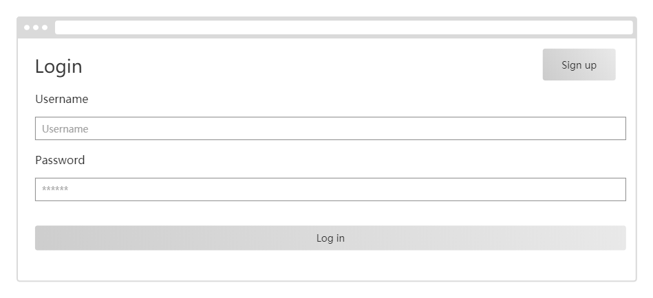
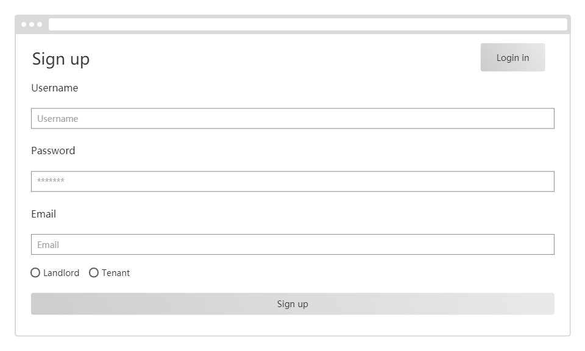

# Document of User Authentication
- [Introduction](#intro)
- [Requirement](#req)
- [API](#api)
- [UI Design](#ui)


## <a name="intro">Introduction</a>
This is the document of user authentication module. This module
implements the sign-in, sign-up, login, and logout functions of 
users. Please refer to this as a guideline. 

## <a name="req">Requirement</a>
### Functional Requirement
- User shall be able to log into their account using username and password
- User shall be able to login as either a tenant or a landlord 
- User shall be able to logout

### Non-functional Requirement
- App shall be able to auto login if user is willing to
- Admin shall be able to login/logout

## <a name="api">API</a>
### /api/users/

#### Request Method
POST

#### Function
Sign-up with username, password, email address and groups. Returns a JSON Web Token 
that can be used for authenticated requests

#### Parameter
| Attribute | Type     | Required | Description|
| ---       |  ------  |--------- |----------- |
| username|  string  | yes      |Username of the user|
| password |  string  | yes      |Password of the user|
| email |  string  | yes      |Email address of the user|
| groups |  string  | yes      |Either 'tenant' or 'landlord'|


#### Response Example
```
{
    'pk': 7,
    'token': "eyJ0eXAiOiJKV1QiLCJhbGciOiJIUzI1NiJ9...",
    'username': "rongzhigu",
    'email': "gurongzhi1997@gmail.com",
    'groups': {
                  {
                      'name': "landlord",
                  }
    }                               
}
```

#### Possible Error State
- 400 BAD REQUEST

---

### /token-auth/
#### Request Method
POST

#### Function
Sign in with username and password. Returns a JSON Web Token 
that can be used for authenticated requests

#### Parameter

| Attribute | Type     | Required | Description|
| ---       |  ------  |--------- |----------- |
| username|  string  | yes      |Username of the user|
| password |  string  | yes      |Password of the user|


#### Response Example
```
{
    'pk': 7,
    'token': "eyJ0eXAiOiJKV1QiLCJhbGciOiJIUzI1NiJ9...",
    'username': "rongzhigu",
    'email': "gurongzhi1997@gmail.com",
    'groups': {
                  {
                      'name': "landlord",
                  }
    }                               
}
```
#### Possible Error State
- 400 BAD REQUEST

---

### /api/current_user/
#### Request Method
GET

#### Function
Determine the current user by their token, and return their data


#### Parameter

| Attribute | Type     | Required | Description|
| ---       |  ------  |--------- |----------- |
| token|  string  | yes      |Stored token of the user|


#### Response Example
```
{
    'pk': 7,
    'username': "rongzhigu",
    'groups': {
                  {
                      'name': "landlord",
                  }
    }                               
}
```
#### Possible Error State
None


## <a name="ui">UI Design</a>
### Login


### Sign up


