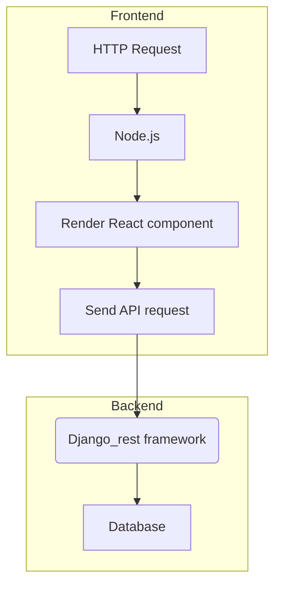

# Website Project
  As for this project, we build a website for tenants and landords to get and post off-campus housing information 

# Reqirements
* Docker version 19.03.5
* docker-compose version 1.21.0
  
# Installation
* git clone [repository](ist-git@git.uwaterloo.ca:ece651/react_django.git)
* sudo docker-compose up

# Some Common Command
* Run backend and frontend at the same time:  
   sudo docker-compose up
* Run frontend alone:  
  sudo docker-compose run frontend npm start / run
* Run backend alone:  
  sudo docker-compose run backend python manage.py runserver 0.0.0.0:8000 --settings=hello_world.settings.development
* Test backend:  
  sudo docker-compose run backend python manage.py test
* Test frontend:  
  sudo docker-compose run frontend npm test
* Git push branch:  
git push origin branch-name
* Git fetch remote branch and checkout:
git fetch origin branch-name
git checkout branch-name
# Software stack
Our website runs on the following software:  
* Ubuntu
* Docker
* Docker-compose
* Django
* React
* Node.js
* SQLite
# CI/CD
* Currently, we rely on gitlab runner to do continuous Integration and Testing.
* Manully deploy our website on the AWS EC2 server:
[Website Link](http://ec2-18-188-108-51.us-east-2.compute.amazonaws.com:3000/)
# Test Tool
* Jest
* Enzyme
# System Architecture

# Meeting log
## Tuesday January 14th
All of the team members share their ideas about the project. And we confirmed the direction of the project and some of the software component.  
## Tuesday January 21th
We begin to learn how to use Docker and Docker-compose to help us unify our development environment.And we also learn how to use Dockerhub repository to store our docker images.
## Tuesday January 28th
We begin to install gitlab runner on our machine and write the gitlab-ci script to configure continuous integration and testing based on gitlab runner.  
## Tuesday February 4th
We begin to learn html, css, js, react, and Django.  
## Tuesday Feburary 11th
we try to dockerize React and Django. And we also try different way to integrate frontend and backend:  
1. Standalone React + Standalone Django
1. Standalone Django + React as a SPA in a Django-App
1. Standalone Django + Mix React into Django-Templates
In the end, we choose to use the first way.  
## Tuesday Feburary 18th
we implement the minimum viable prototype which include following functions:
1. create new items
1. update existing items
1. delete existing items
1. list existing items
# Tuesday Feburary 25th
we try to test the mvp and do some code review.In addition, we discuss which feature we should implement at next iteration.  
